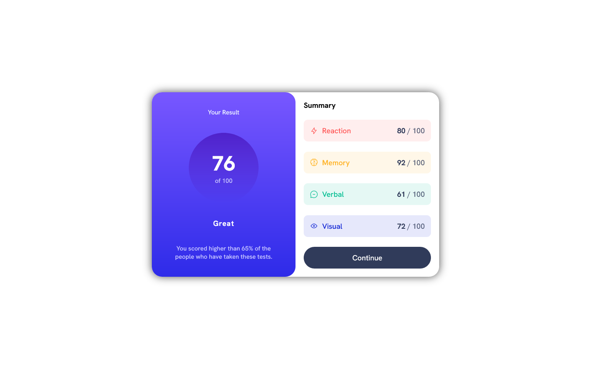
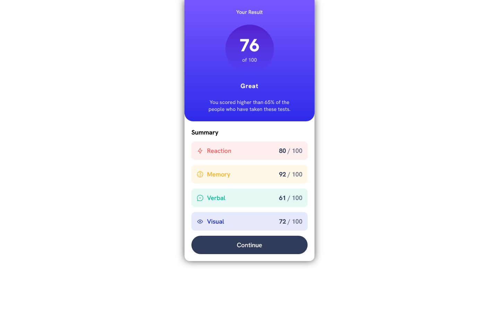

# Frontend Mentor - Results summary component solution

This is a solution to the [Results summary component challenge on Frontend Mentor](https://www.frontendmentor.io/challenges/results-summary-component-CE_K6s0maV). Frontend Mentor challenges help you improve your coding skills by building realistic projects. 

## Table of contents

- [Overview](#overview)
  - [The challenge](#the-challenge)
  - [Screenshot](#screenshot)
  - [Links](#links)
  - [Built with](#built-with)
  - [Useful resources](#useful-resources)
- [Author](#author)

## Overview

### The challenge

Users should be able to:

- View the optimal layout for the interface depending on their device's screen size
- See hover and focus states for all interactive elements on the page

### Screenshot

### Links

- Solution URL: [Solution URL](https://github.com/BarrosLucasJavier/resultsSummaryComponent)
- Live Site URL: [Live site URL](https://barroslucasjavier.github.io/resultsSummaryComponent/)

### Built with

- Semantic HTML5 markup
- CSS custom properties
- Flexbox
- Mobile-first workflow

### Useful resources

- [Refuerzo de conceptos](https://developer.mozilla.org/en-US/) - Me ayudo con la estructura de ciertas propiedades de css

## Author

- GitHub - [Barros Lucas Javier](https://github.com/BarrosLucasJavier)
- Frontend Mentor - [@BarrosLucasJavier](https://www.frontendmentor.io/profile/BarrosLucasJavier)
